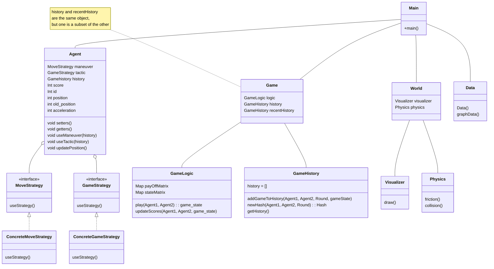

```mermaid
classDiagram
    class Main{
        +main()
    }

    class Agent {
        MoveStrategy maneuver
        GameStrategy tactic
        Gamehistory history
        Int score
        Int id
        int position
        int old_position
        int acceleration

        void setters()
        void getters()
        void useManeuver(history)
        void useTactic(history)
        void updatePosition()
    }

    class MoveStrategy {
        %% Preferably physics data is handed to this
        <<interface>>
        useStrategy()
    }

    class GameStrategy {
        <<interface>>
        %% Preferably game data is handed to this
        useStrategy()
    }

    class ConcreteMoveStrategy {
        useStrategy()
    }

    class ConcreteGameStrategy {
        useStrategy()
    }

    Agent o-- MoveStrategy
    Agent o-- GameStrategy
    MoveStrategy <|.. ConcreteMoveStrategy
    GameStrategy <|.. ConcreteGameStrategy

    class Game{
        GameLogic logic
        GameHistory history
        GameHistory recentHistory
    }

    note for Game "history and recentHistory
     are the same object,
     but one is a subset of the other"


    class GameLogic {
        Map payOffMatrix 
        Map stateMatrix
        play(Agent1, Agent2): game_state
        updateScores(Agent1, Agent2, game_state)
    }

    class GameHistory {
        history = []
        addGameToHistory(Agent1, Agent2, Round, gameState)
        newHash(Agent1, Agent2, Round): Hash
        getHistory()

    }

    Game -- GameLogic
    Game -- GameHistory

    class World {
        Visualizer visualizer
        Physics physics
    }

    class Visualizer {
        draw()
    }

    class Physics {
        friction()
        collision()
    }

    World -- Visualizer
    World -- Physics


    class Data {
        Data()
        graphData()
    }

    Main -- Agent
    Main -- Game
    Main -- World
    Main -- Data
```