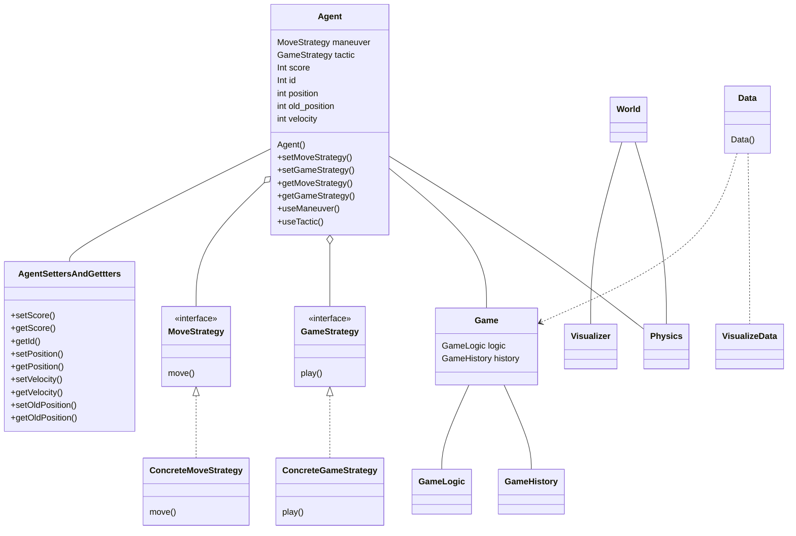

```mermaid
classDiagram
    class Agent{
        MoveStrategy maneuver
        GameStrategy tactic
        Int score
        Int id
        int position
        int old_position
        int velocity

        Agent()
        +setMoveStrategy()
        +setGameStrategy()
        +getMoveStrategy()
        +getGameStrategy()
        +useManeuver()
        +useTactic()

    }
    class AgentSettersAndGettters {
        +setScore()
        +getScore()
        +getId()
        +setPosition()
        +getPosition()
        +setVelocity()
        +getVelocity()
        +setOldPosition()
        +getOldPosition()
    }    
    Agent -- AgentSettersAndGettters
    class MoveStrategy {
        %% Will need to figure out what gets handed to this
        <<interface>>
        move()
    }

    class GameStrategy {
        <<interface>>
        %% Will need to figure out what gets handed to this
        play()
    }

    class ConcreteMoveStrategy {
        move()
    }


    class ConcreteGameStrategy {
        play()
    }

    Agent o-- MoveStrategy
    Agent o-- GameStrategy
    MoveStrategy <|.. ConcreteMoveStrategy
    GameStrategy <|.. ConcreteGameStrategy

    class Game{
        GameLogic logic
        GameHistory history
        
    }

    class GameHistory {

    }

    class GameLogic {

    }

    Game -- GameLogic
    Game -- GameHistory


    

    class World{

    }

    class Visualizer{

    }

    class Physics{

    }

    World -- Visualizer
    World -- Physics

    class Data {
        Data()
    }

    class VisualizeData {

    }

    Data ..> Game
    Data .. VisualizeData

    %% Interclass relations

    Agent -- Game
    Agent -- Physics


```